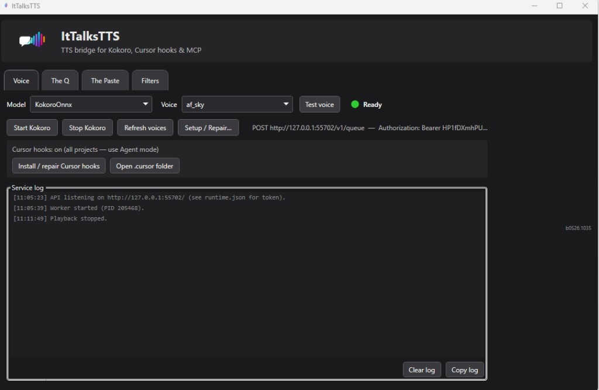
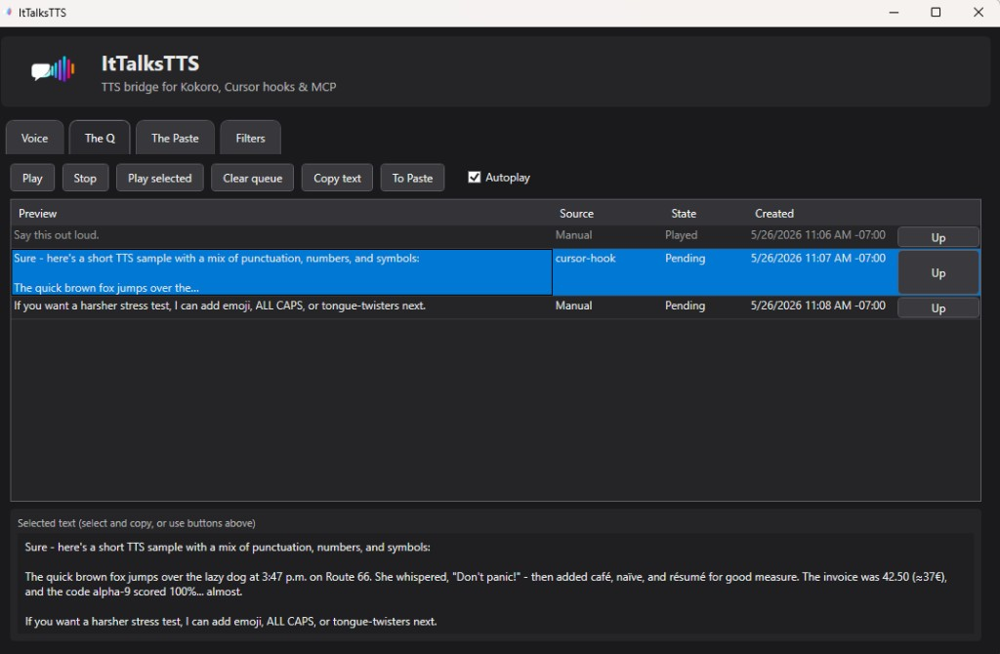
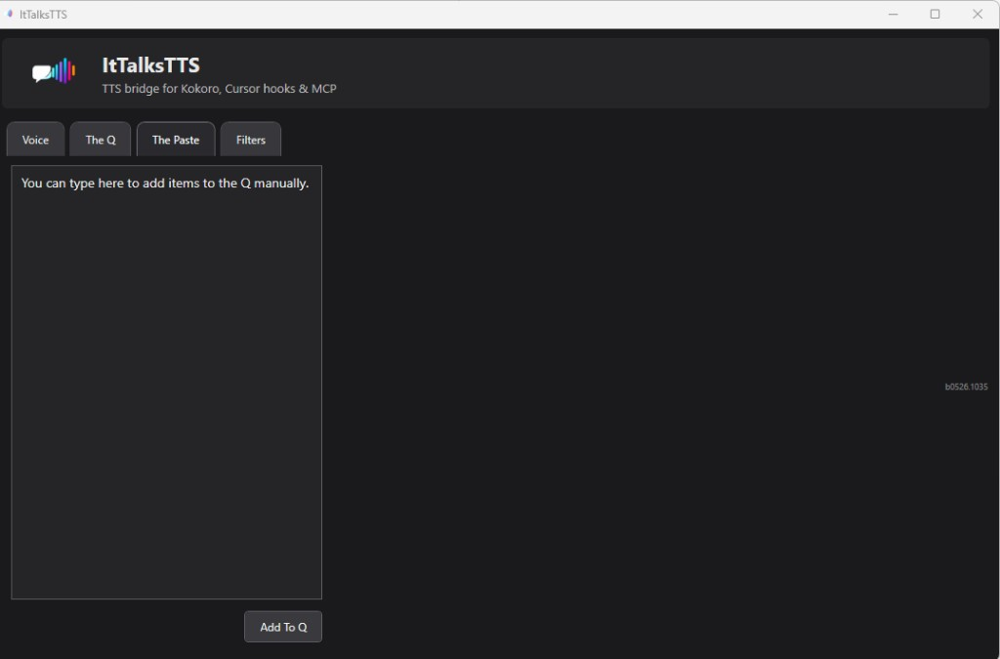

<p align="center">
  
</p>

# ItTalksTTS

Windows desktop app that bridges **[Kokoro](https://github.com/thewh1teagle/kokoro-onnx)** text-to-speech, a **playback queue (The Q)**, a **local HTTP API**, and optional **Cursor** hooks / MCP.

TLDR: This uses the open-source Kokoro text-to-speech engine to read text aloud locally — free, open source, and private. Queue Agent replies from Cursor hooks, paste anything into **The Paste**, or POST to the local API.

## See it in action

### Video walkthrough

<video src="docs/media/ItTalksTTS_rundown.mp4" controls width="100%">
  Your browser does not support embedded video. <a href="docs/media/ItTalksTTS_rundown.mp4">Download the rundown video</a>.
</video>

### Screenshots

**Voice** — start Kokoro, pick a voice, install Cursor hooks, and watch the service log.



**The Q** — playback queue with Autoplay, copy/send-to-paste, and full text preview for selected rows.



**The Paste** — type or paste text and add it to the queue (filters apply before enqueue).



## Install

**You only need the setup program.**

1. Download **`ItTalksTTS-Setup.exe`** from **[GitHub Releases](https://github.com/DragonDumpling/ItTalksTTS/releases)** (Assets on the latest release — no need to clone the repo).
2. **Double-click** it and follow the wizard (Next → Install → Finish).
3. Launch **ItTalksTTS** from the desktop shortcut or Start menu (the installer can launch it for you).

**First launch:** the app opens a one-time setup window automatically. It installs Kokoro’s Python pieces and downloads voice models over the internet (often a few minutes). You do not need to install Python or .NET separately when using the setup EXE.

**Then:** use the app — paste or enqueue text, press **Play** in **The Q** (or turn on **Autoplay**). On the **Voice** tab, **Start Kokoro** if you want speech right away after setup.

| You want… | Do this |
|-----------|---------|
| Hear queued text | **The Q** → **Play** (or enable **Autoplay**) |
| Cursor Agent → queue | Install setup, run app once, restart Cursor — [details](#cursor-integration) |

---

## Features

- **Voice** — Kokoro worker, voices, test line, service log.
- **The Q** — Queue, play/pause, replay, reorder, Autoplay.
- **The Paste** — Paste, filter, enqueue.
- **Filters** — Persistent normalization rules.
- **Local API** — `POST /v1/queue` (bearer token while the app runs).
- **Cursor hooks** — Agent replies → The Q (`cursor-hook`).
- **MCP** (optional) — `EnqueueTts`, `GetApiStatus`.

---

## Cursor integration

The installer configures **user-level** Cursor hooks (`~/.cursor/hooks.json`) so Agent replies enqueue to The Q from **any project** — no clone of this repo.

1. Install **ItTalksTTS-Setup.exe** and run the app once.
2. Restart Cursor.
3. Use **Agent** mode in your own codebase.

**Guide:** [docs/cursor-integration.md](docs/cursor-integration.md)

---

## For developers (build from source)

**Requirements:** Windows, [.NET 9 SDK](https://dotnet.microsoft.com/download/dotnet/9.0).

```powershell
cd path\to\ItTalksTTS
dotnet build .\ItTalksTTS.sln -c Release
.\src\ItTalksTTS.App\bin\Release\net9.0-windows\ItTalksTTS.exe
```

First run still auto-downloads Kokoro models; use **Python 3.10+** on PATH unless you published with embedded Python (installer build does).

### Build the Windows installer (maintainers)

Needs .NET 9 SDK + [Inno Setup 6](https://jrsoftware.org/isinfo.php):

```powershell
.\installer\build.ps1
```

Output: **`release\ItTalksTTS-Setup.exe`** plus **`release\README.txt`**. Zip the `release` folder for download so the setup file is obvious at the top level. The script publishes the app (self-contained + embedded Python + Kokoro worker scripts) and compiles the installer.

### App icon

`ittalks-logo-rgb.png` (master, may be RGB on black) → `ittalks-logo.png` (32-bit alpha for the app). After replacing the master:

```powershell
.\tools\rgb-logo-to-alpha.ps1 -SourcePath .\src\ItTalksTTS.App\Assets\ittalks-logo-rgb.png -DestPath .\src\ItTalksTTS.App\Assets\ittalks-logo.png
.\tools\png-to-ico.ps1 -PngPath .\src\ItTalksTTS.App\Assets\ittalks-logo.png -IcoPath .\src\ItTalksTTS.App\Assets\ittalks.ico
```

### Solution layout

| Project | Role |
|--------|------|
| `ItTalksTTS.App` | WPF UI, playback, API host |
| `ItTalksTTS.Core` | Queue, persistence, filters, encoding |
| `ItTalksTTS.Tts` | Kokoro worker / setup |
| `ItTalksTTS.Api` | Local HTTP API |
| `ItTalksTTS.HookEnqueue` | Cursor hook → API |
| `ItTalksTTS.McpServer` | MCP stdio server |
| `ItTalksTTS.Tests` | Unit tests |

### Data locations

| Path | Purpose |
|------|---------|
| `%LocalAppData%\ItTalksTTS\settings.json` | Voice, filters, API token, Autoplay |
| `%LocalAppData%\ItTalksTTS\runtime.json` | API port (while running) |
| `%LocalAppData%\ItTalksTTS\models\` | Kokoro ONNX + voices |
| `%LocalAppData%\ItTalksTTS\queue.json` | Saved queue |

## License

[MIT](LICENSE)
